# Chapter1 LaTeX的基本概念
## 1.1 LaTeX命令和环境
命令以斜线\开头，命令对大小写敏感。

* 可选参数用[optional arguments]包裹
* 必选参数用{mandatory anguments}包裹。

**环境**
\begin{environment} [optional arguments] {mandatory anguments}
...
\end{environment}

## 1.2 LaTeX代码结构
\documentclass{文档类}
    导言区
\begin{document}
    正文内容...
\end{document}

## 1.3 文档类和宏包
“标准文档类”：article,report,book此三者不支持中文排版，因此派生了ctexart,ctexrep,ctexbook。

文档类命令的可选参数规定了排版的样式，如：
* 字号：10pt（默认）,11pt,12pt
* 纸张大小：letterpaper（默认）,a4paper,a5paper,b5paper,legapaper
* 单双面排版：oneside(article和report默认),twoside(book默认)。双面排版时，奇偶页的页眉页脚、页边距不同
* 单双栏排版：onecolum（默认）,twocloum
* 新章开始页：openany(report默认),openright(book默认),对article而言该参数无效

在导言区我们一般会放置文档所需的宏包以及实现文档特定样式的自定义命令。宏包的调用命令为：
* \usepackage[optional]{package}

## 1.4 文件的组织方式
由于LaTeX文档不是所见即所得，所以在编写长文档时的校对工作是十分繁琐复杂的。为此，我们选择把文档分为多个部分进行书写，也就是建立多个.tex文件。在文档合并时可以采用命令：
* \include{文件名}

如果引入的文件与要编译的文件不在同一个目录时则需要加上相对路径或者绝对路径。

值得注意的是\include在读入文件前会另起一页，如果不想这样，则可以采用命令：
* \input{文件名}

# Chapter2 排版文字
排版中文、中外混合时文档类型选择ctexart,ctexrep,ctexbook。
## 2.1 字符
* 空格键、Tab键以及多个空格键视为一个空格
* 空行及多个空行视为一个分段
* 注释采用符号%，该符号后的内容在编译后不显示
* 转义字符：

* 破折号：

* 省略号：\dots

## 2.2 断行和段页
* 断行：\\[断行距离],\\*[length]星号表示禁止在断行处分页,\newline。第一种方式也在表格、公式等处用于换行。
* 断页：\newpage,\clearpage,在双栏排版中前者只能起到另起一栏的作用。

# Chapter3 文档元素
## 3.1 文档结构
1. 章节标题：注意\chapter只在report和book文档类中有定义

2. 目录：在适当位置运用命令
    * \tableofcontents 该命令会生成单独一章(report,book)或一节(article)，默认标题为Contents但不会写入目录。
    * 对于带星号的章或节命令是不写入目录的，如果要写入可采用命令：
    * \addcontentsline{toc}{level}{title} 其中level为待写入的章或节的层次，title为目标显示的章节标题。
3. 文档结构：仅限book文档类使用
    * \frontmatter 前言部分
    * \mainmatter 正文部分
    * \backmatter 后记部分
    

## 3.2 交叉引用
能够被引用的部分使用命令：
* \label{标签名}
在需要引用的位置使用命令：
* \ref{标签名},\pageref{标签名}

可使用\label命令的位置：

## 3.3 脚注和边注
1. 在页面底部生成脚注可使用命令：
    * \footnote{注释内容}

    在表格环境和各种盒子内，直接运用上述命令并不能正确生成脚注。需要先使用\footnotemark为脚注计数，后在合适的位置运用\footnotetext生成脚注。如：

2. 在边栏生成边注可使用命令：
    * \marginpar[]{}

## 3.4 特殊环境
### 列表
1. 有序列表：
    * \begin{enumerate}
        \item 内容...
        \item 内容...
    \end{enumerate}

2. 无序列表：
    * \begin{itemize}
        \item 内容...
        \item 内容...
    \end{itemize}

两类列表最多嵌套四层，\item[]的可选参数用以将有序列表的计数或者无序列表的符号替换为写入参数的符号。

有序列表符号的重新定义使用命令：
* \renewcommand{\labelenumi}{新符号定义}其中labelenumi表示对第一层重新定义

无序列表符号的重新定义使用命令：
* \renewcommand{\labelitemiv}{新符号定义}其中labelenumi表示对第四层重新定义

### 对齐环境
* \begin{center}...\end{center}
* \begin{flushleft}...\end{flushleft}
* \begin{flushright}...\end{flushright}
* 或者用命令\centering,\raggedright,\raggedleft对其后的文字进行对齐处理

### 引用环境

### 代码环境
* \begin{verbatim}...\end{verbatim}

### 表格

## 3.5 图片
运用插图功能时，需要借助宏包：**graphicx**。然后用插入图片的命令：
* \includegraphics[options]{文件名}

可选参数才用键值对的方式输入，具体包括：

## 3.6 盒子
1. 水平盒子：
    * \mbox{内容...}
    * \makebox[width][align]{内容...}

2. 带框的水平盒子：
    * \fbox{...}
    * \framebox[width][align]{...}

## 3.7 浮动体
LaTeX预定义了两类浮动体环境figure和table，习惯上figure里放图片，table里放表格，但没有严格的限制。可以在任何一个浮动体里放置文字、公式、表格、图片等任意内容。具体命令为：
* \begin{table}[placement]
    ...
    \end{table}

参数的选择为：

**浮动体的标题**
图表等浮动体可以添加自动编号的标题，命令为：
* \caption{标题名}

并且其后还可以定义引用标签。

# Chapter4 排版数学公式
排版数学公式时我们需要宏包**amsmath(基本),amsfonts,amssymb(字母),bm(粗斜体),latexsym,yhmath(特殊符号)**

1. 行内行间公式：

* 行内公式：$ x^2+y^2=1 $
* 行间公式：使用**equation**环境，并且公式会自动生成编号，可用\label和\ref生成交叉引用。
    * \eqref命令可为引用自动加上圆括号
    * \tag命令手动修改公式编号，\notag命令取消公式编号
* 无编号的行间公式可用\[ x^2+y^2=1\]

2. 数学模式：

* 数学模式中输入的空格会被忽略，产生空格需命令：
    * \quad,\qquad
* 不允许有空行（分段），排版多行公式需要各种环境
* 所有字母当作变量处理，若要忽略此处理，则需要命令：
    * \mathrm,\text

## 4.1 数学符号
**希腊字母**

**常用符号**

**上下标**
上标^，下标_

**分式和根式**
* 分式：\frac{分子}{分母}
* 根式：\sqrt{}
* n次根式：\sqrt[n]{}
* 二项式：\binom{}{}

**关系符**

**算符**

自定义算符命令：
* \DeclareMathOperator{调用命令}{算符具体定义}
* \DeclareMathOperator*{调用命令}{算符具体定义}星号表示带上下限

**巨算符**

命令\substack{...}能够在下线位置书写多行表达式。如： \limt_{\substack{P\to P_0 \\\ P\in D}}f(P) 

**重音及上下括号**

* \overbrace和\underbrace命令用来生成上/下括号，并且各自可带一个上/下标表达式。

**箭头**

* \xleftarrow和\xrightarrow命令提供长度可以伸展的箭头，并且可以添加上下标。如：

**括号和定界符**

* 使用\left和\right命令可令括号或定界符的大小改变，且必须成对使用。

## 4.2 多行公式

**长公式折行**
* multline环境下可用双斜线\\\折行，将
公式编号放在最后一行。多行公式的首行左对齐，末行右对齐，其余行居中。

**多行公式**
* 多行公式借助align环境，它将公式用&隔为两部分并对齐，分行可用双斜线。但是该环境下会对每行公式编号，可用\notag去掉编号。
* align环境还能够对齐多组公式，公式间也用&符号分隔。
* 如果多行公式用一个编号且编号居中，则需要将aligned嵌套在equation环境中。aligned的用法与align的用法类似。

## 4.3 数组和矩阵
**矩阵**
借助与array环境，如：

**矩阵环境**

## 4.4 数学字母字体
**字母字体**

**粗斜体**
* 使用命令：\bm{...}

## 4.5 定理环境
原始的LaTeX没有现成的定理环境，但提供了定义定理环境的命令：
* \newtheorem{theorem environment}{title}{level}
* \newtheorem{theorem environment}
[counter]{title}
    * level为章节级别，如chapter,section等，定理序号成为章节的下一级标题。
    * counter为用\newcounter定义的计数器名称。

# Chapter5 排版样式设定
## 5.1 字体和字号
**字体样式**

**字号**

**字体宏包**

修改字体的宏包有**fontspec,ctex**后者用于修改中文字体，还有修改数学字体的宏包unicode-math。

## 5.2 文字强调
* \underline命令不够灵活
* **ulem**宏包中\uline命令可生成换行的下划线

## 5.3 段落格式和间距
**长度**

自定义长度变量：
* \newlength{调用命令}
* \setlength{command}{length}给长度变量直接赋值
* \addtolength{command}{length}增加长度

**行距**

**缩进**
* 段落左缩进：\setlength{\leftskip}{length}
* 段落右缩进：\setlength{\rightskip}{length}
* 首行缩进：\setlength{\parindent}{length}
* 段落缩进命令：
  * \indent 强制缩进
  * \noindent 取消缩进

$\LaTeX$默认在章节标题后的第一段不缩进，可用宏包**indentfirst**修改。

**水平间距**
命令：\hspace{length}其中长度若以em为单位，则生成的间距随字号大小改变。若命令加星号，则不会因断页等情形而取消间距。

**垂直间距**
命令：\vspace{} 同样可以加星号。

## 5.4 页面和分栏
**genmetry宏包**
命令：\genmetry{页面设置参数} 参数以键值对的格式给出。
如：A4纸张，上下边距1英寸，左右边距1.25英寸
  * \geometry{a4paper,left=1.25in,right=1.25in,top=1in,bottom=1in}
  * \geometry{a4paper,hmargin=1.25in,vmargin=1in}

对于书籍等双面文档，奇数页右边、偶数页左边的页边距较大
  * \geometry{inner=1in,outer=1.25in}

**分栏**
对于分栏有全局的设置选项：onecolumn,twocolumn。也有切换的命令：\onecolnmn,\twocolumn[参数]

## 5.5 页眉页脚
* \pagestyle{page-style} 修改页眉页脚样式；
* \thispagestyle{page-style} 修改当前页页眉页脚样式

$\LaTeX$预设的页眉页脚样式

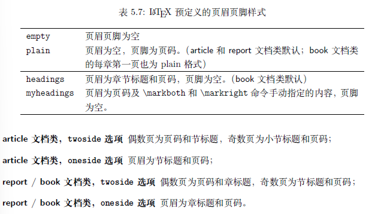

* \pagenumberin{style} 修改页眉页脚的页码样式，样式包括默认arabic(阿拉伯数字),roman(小写罗马数字),Roman(大写罗马数字)

* 对于页眉页脚样式headings,myheadings,我们可以用以下命令修改页眉页脚内容。
  * \markright{右页（偶数页）内容}
  * \markboth{左页（奇数页）内容}{右页（偶数页）内容}

**fancyhdr宏包**
fancyhdr 宏包改善了页眉页脚样式的定义方式，允许我们将内容自由安置在页眉和页脚的
左、中、右三个位置，还为页眉和页脚各加了一条横线。
使用fancyhdr 宏包定义页眉页脚之前，通常先用\pagestyle{
fancy} 调用这个样式。在fancyhdr 中定义页眉页脚的命令为：
  * \fancyhf{} 清空预定样式
  * \fancyhead[position]{}
  * \fancyfoot[position]{}
  * 其中position的参数为L,C,R与O(奇数页),E(偶数页)的组合

示例：
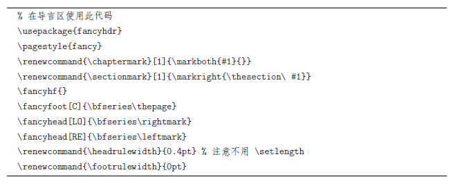

# Chapter6 特色工具和功能
## 6.1 参考文献和BibTeX工具
$\LaTeX$中参考文献的引用方式比较原始，需要自行书写参考文献列表包括格式，所以是较难使用的。
* \cite{文献标签} 引用参考文献命令，其中标签类似\ref中的标签
* thebibliography环境中书写参考文献，每条文献由\bibitem命令开头

由于手写参考文献的难度较大，所以我们一般使用BIBTeX数据库管理参考文献。
* 每条文献的格式为：
  * @文献格式{文献标签，
    key1 = value1,
    key2 = value2,
    ...
    }

其中文献格式包括：

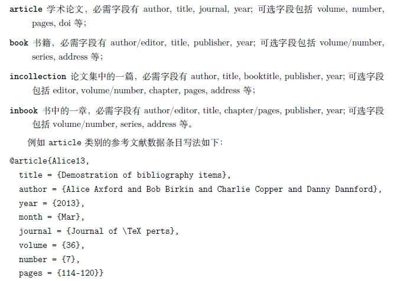

**使用BibTeX排版参考文献**
1. 准备好BibTeX数据库，即有一份扩展名为.bib的文件；
2. 在$\LaTeX$代码中用命令\bibliographystyle{style}设置参看文献格式。格式有：plain,unsrt,alpha等；
3. 引用时使用命令：\cite{文献标签}；
4. 注意在文档中生成文献列表时，通常只会列出被引用的文献。如果想要文档将全部文献列出，则使用命令：\nocite{*}；
5. 在需要列出参考文献的位置使用命令：\bibliography{数据库名（文件名）}。

## 6.2 索引和makeindex工具
**makeindex的使用方法**
1. 调用**makeidx**宏包，并使用命令\makeindex 收集索引；
2. 在需要索引的地方使用\index命令，并在需要输出索引的地方使用\parintindex命令。

**索引的写法**
* \index{索引项} 添加索引命令

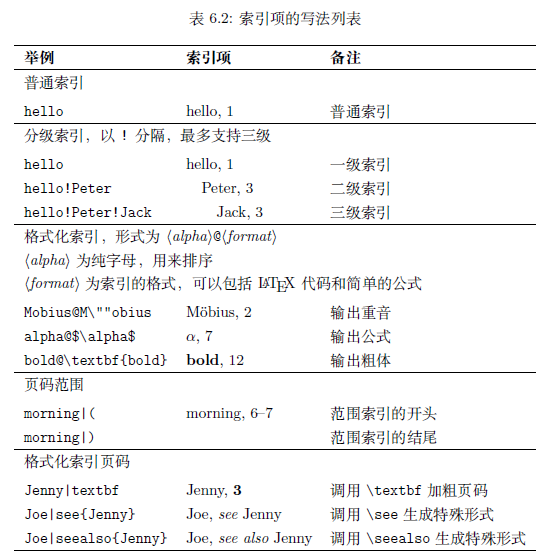

## 6.3 使用颜色
使用颜色需要调用宏包**color,xcolor**
* \color[mode]{code} 其中mode如rgb,cmyk,gray,code对rgb而言就是颜色代码；
* \color{color-name}
颜色名：

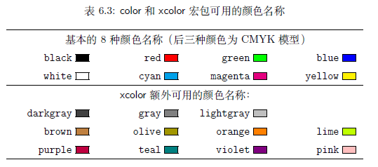

* \definecolor{color-name}{mode}{code} 自定义颜色

**带颜色的文本和盒子**
带颜色的文本可以使用命令：
 * \textcolor[mode]{code}{text}
 * \textcolor{name}{text}
 * 
带背景色的盒子可以使用命令：
 * \colorbox[mode]{code}{盒子内容}
 * \colorbox{name}{盒子内容}

带背景色及有色边框的盒子使用命令：
 * \fcolorbox[mode]{fcode}{code}{material}
 * \fcolorbox{fcolor-nmae}{color-name}{material}
其中fcode,fcolor-name用以设置边框颜色。

## 6.4 超链接
$\LaTeX$中使用超链接需要调用**hyperref**宏包
* \hypersetup{参数} 用以设置超链接参数，具体参数包括：

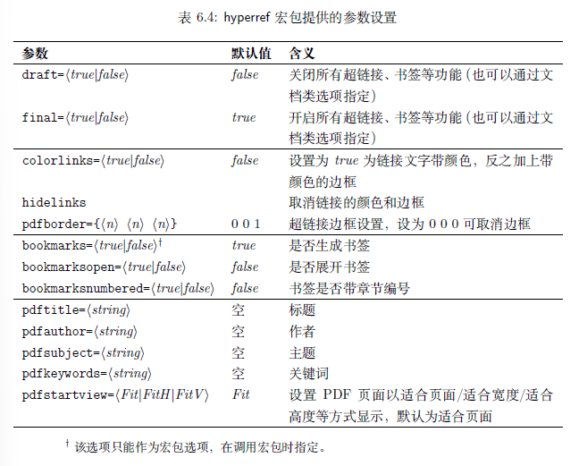

**超链接**
* \url{链接} 生成可跳转的超链接
* \nolinkurl{...} 生成不可跳转的超链接
* \href{url}{text} 点击文本跳转到链接

# Chapter7 编写文档类和宏包
## 7.1 自定义命令和环境
**定义命令**
* \newcommand{\命令名}[参数]{definition} 其中参数是指命令具体定义中可传入的参数个数，最多9个。并且在命令定义中需要传入参数的位置用#1，...，#9替换。
* \renewcommand{\name}[num]{definition} 由于前一命令可能与存在的命令冲突，则采用后一命令重新定义已存在的定义。一般地，我们选择定义一个新命令，而不是直接修改原命令。

**定义环境**
* \newenvironment{name}[num]{before}{after}
* \renewenvironment

**xparse宏包**
如果需要定义带有多个可选参数、或者带星号的命令或环境，可以使用xparse宏包。
* \NewDocumentComman\name{参数}{definition}
* \NewDocumentEnvironmeng{name}{参数}{before}{after}

参数格式：

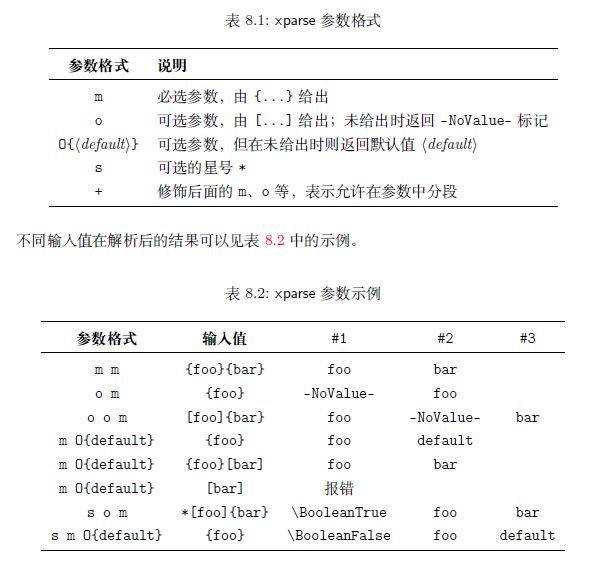

## 7.2 编写文档类和宏包
**编写文档类**
文档类的扩展名为.cls
* \NeedsTeXFormat{LaTeX2e}[YYYY/MM/DD] 文档类开头必须的命令，用以指明文档类所需的$\LaTeX$版本，可选参数为相应版本的日期，且必须严格按照格式书写。
* \ProvidesClass{name}[YYYY/MM/DD description] 表示文档类的命令，并且name需要与文档类文件名一致,可选参数为文档类版本日期及对该文档类的描述。
* \LoadClass{} 如果编写文档类时，某些命令在其他文档类中存在，则可使用该命令加载其他文档类以导入相应功能。
* 初始设置：在文类文件的开始处需要定义一些后面程序中要用到的数据命令和条件控制命令，并预先设定条件的真假，它们将用于后面相关条件的判断，以确定程序的运行方向。
  * \newcommand\name{} 表示预设命令name并且赋值为空
  * \newif\if name 判断语句

* 选项设置：条件判断后，符合条件后的选项设置
  * \if 条件
        ...
    \else
        ...
    \fi 结束语

**编写宏包**
宏包的扩展名为.sty，在$\LaTeX$文档中使用命令\usepackage{}可以调用宏包。
* \ProvidesPackage{name} 标识宏包的命令，是一个宏包文件中必须的。并且name需要与宏包文件名一致。
* \RequirePackage{} 编写宏包我们需要其他宏包的支持时使用该命令引入目标宏包。

## 7.3 计数器
**定义计数器**
* \newcounter{counter name}[parent counter name] 计数器有上下级的关系，可选参数parent counter name 为counter name 的上级计数器。
* \setcounter{name}{number} 将计数器name的值设置为number
* \addtocounter{name}{number} 将计数器name 的值加上number
* \stepcounter{name} 将计数器name值加一，并将下级计数器归零

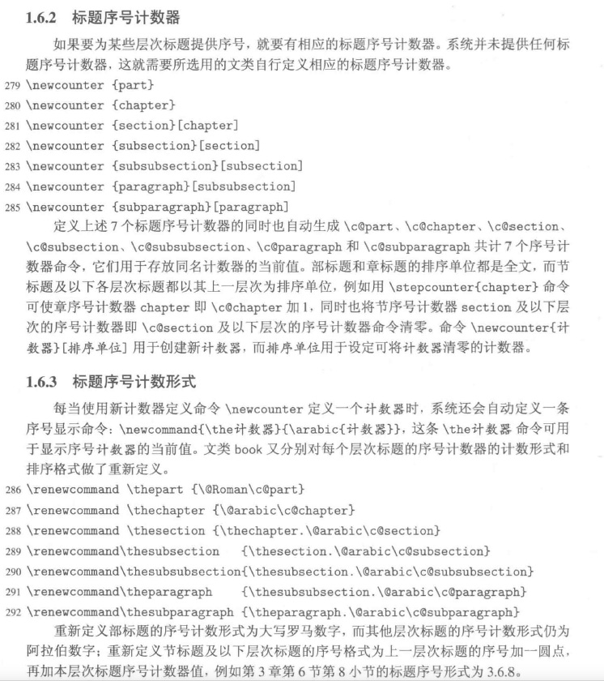

**计数器输出格式**
计数器name的输出格式由\thename表示，修改格式方法为：
* \newcommand\thename{格式}
* \renewcommand\thename{格式}

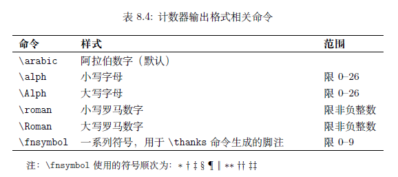

计数器的格式可以混合其他命令，如标准文档中对\subsection的计数器定义相当于：
 * \renewcommand\thesubsection{\thesection.\arabic{subsection}}

**$\LaTeX$中的计数器**
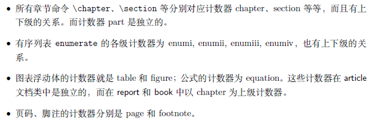

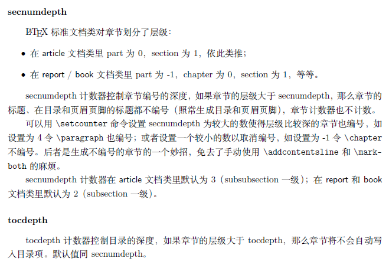

系统定义的secnumdepth计数器用于控制层次标题的排列深度，其默认值为0，即只对章标题排序，二章以下的个层次标题都不给出序号。
  * \setcounter{scenumdepth}{2} 将层次标题排列深度赋值为2，此时，章标题、节标题和小节标题都将给出序号。

**定制命令和参数**
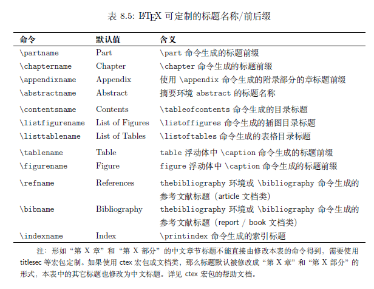

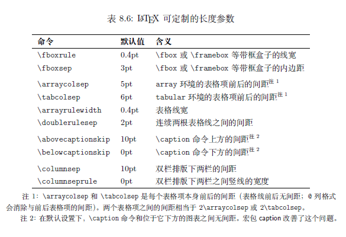

# 附录 常用宏包
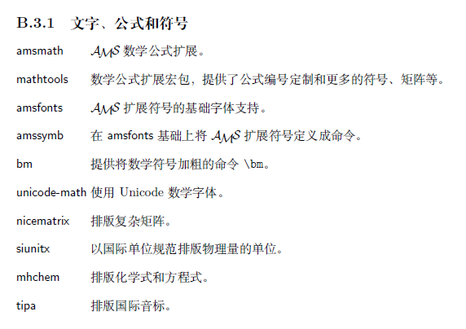
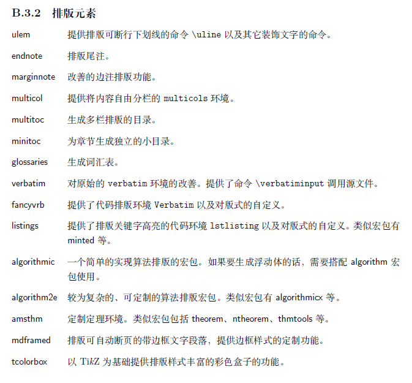
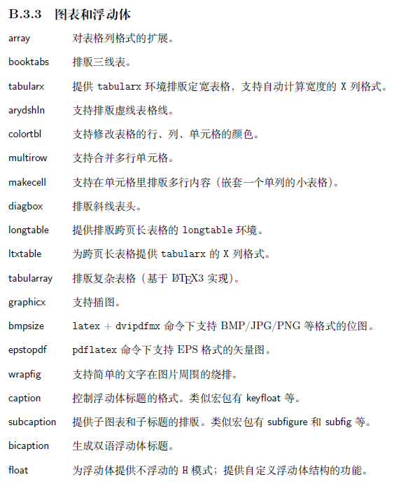
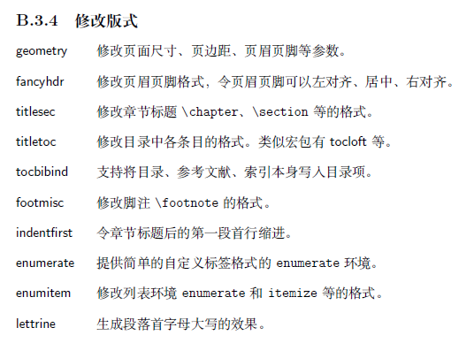
